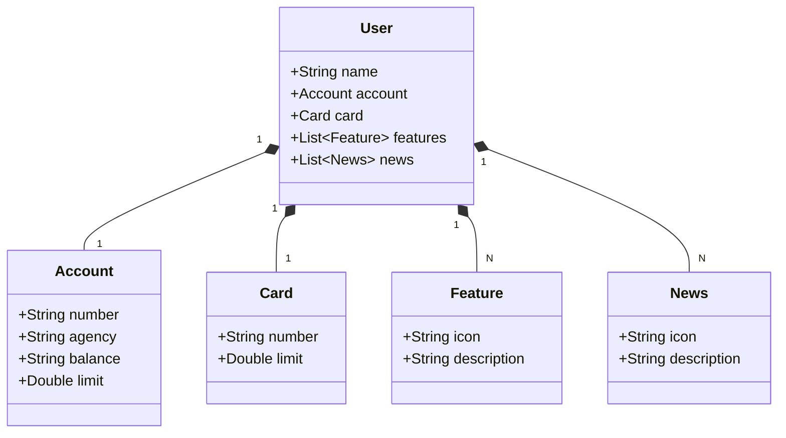

## API RESTful para estudo de um Domínio Bancário com Kotlin e Spring Boot

**Projeto feito com Kotlin no Java 21 e Spring Framework 3.3.1**

## Sobre o Projeto
Este projeto é uma API de RESTful desenvolvida em Kotlin, ele foi feito para aplicar conceitos aprendidos com Kotlin.

## Diagrama de Classes

## Tecnologias utilizadas

- Kotlin
- Gradle
- Spring Boot
- Spring Data JPA
- H2 Database
- PostgreSQL

## Iniciando projeto
Para iniciar a aplicação execute a seguinte ação na pasta do projeto

    ./gradlew bootRun

Instale as dependências do gradle com o comando:

    ./gradlew dependencies

## Autor

**João Vitor Neves Marques**  
e-mail: jvneves_marq@hotmail.com  
LinkedIn: https://www.linkedin.com/in/jvneves/
